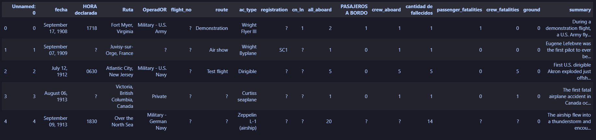
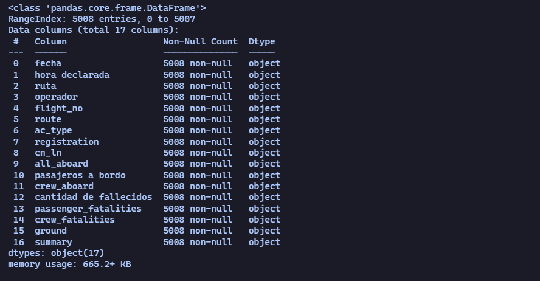
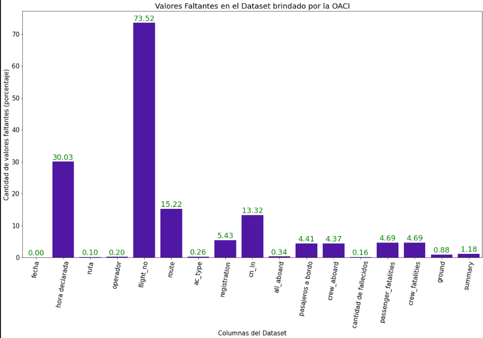
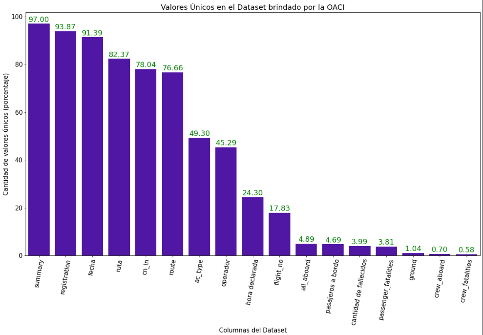
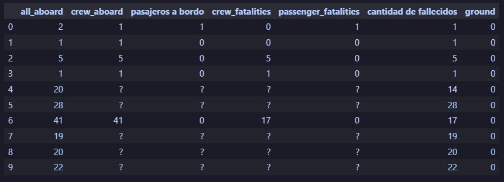
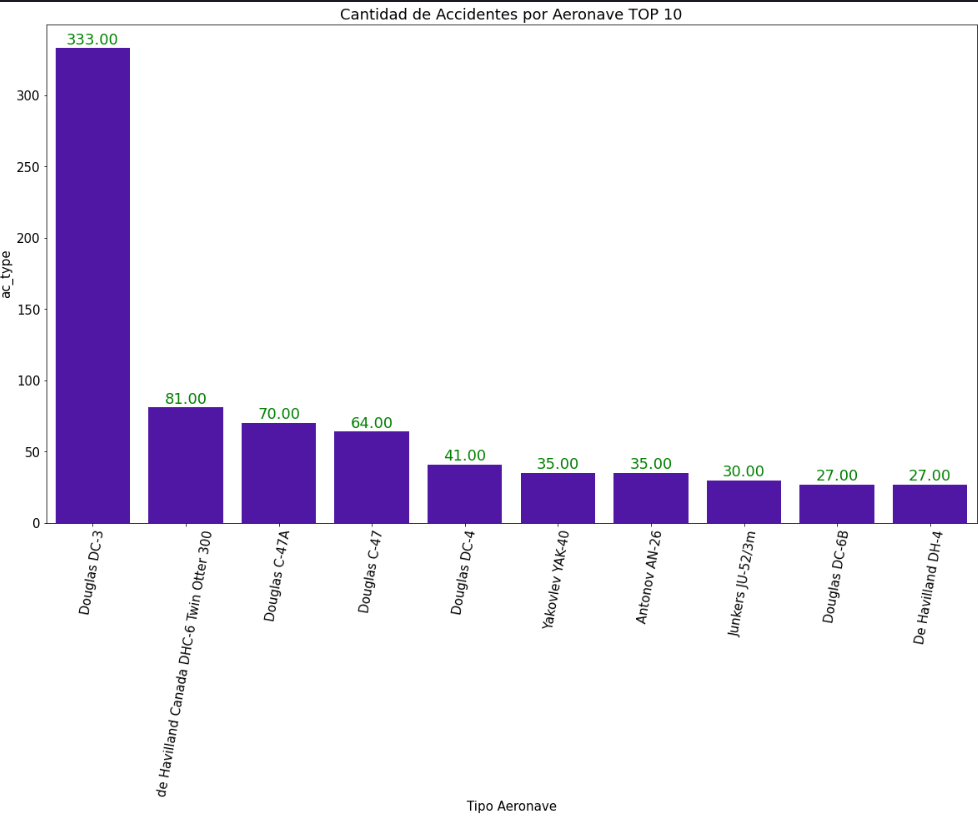
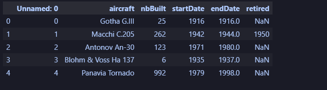
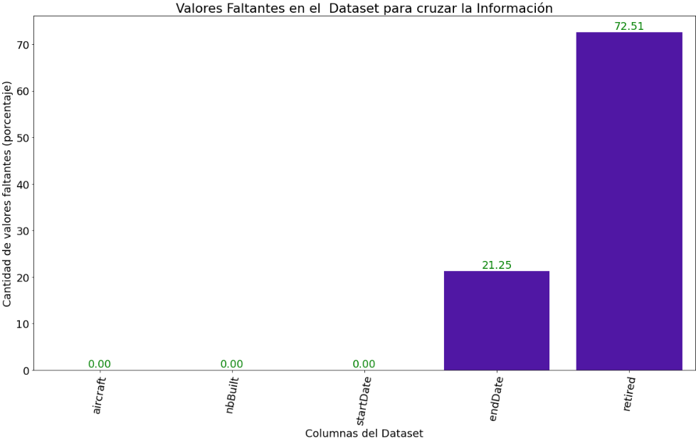
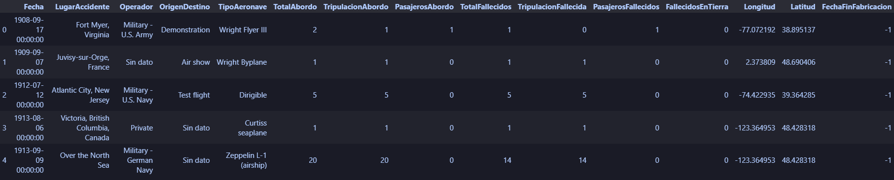

# Accidentes de Aviones


## Contexto
La Organización de Aviación Civil Internacional (OACI), organismo de la Organización de las Naciones Unidas, quiere investigar en profundidad los accidentes producidos desde inicios del siglo XX. Para ello, nos solicita la elaboración de un informe y un dashboard interactivo que recopile tal información.
La OACI únicamente cuenta con un dataset sobre datos de accidentes de aviones, pero insta a la consultora de datos -de la que formamos parte- que intente cruzar esta información con otras fuentes de su interés. Esto con el objetivo de obtener mayor claridad y consistencia en los fundamentos del estudio.

## Diccionario de Datos
El dataset brindado por la OACI llamado AccidentesAviones_Henry presenta las siguientes columnas:
- Unnamed: índice de los registros.
- fecha: fecha del accidente en el formato Mes (texto), Día, Año.
- HORA declarada: hora del accidente en diferentes formatos.
- Ruta: lugar del accidente.
- OperadOR: empresa u organismo que utilizaba la aeronave. 
- flight_no: número de vuelo.
- route: origen y destino del vuelo.
- ac_type: tipo de aeronave.
- registration: registro OACI de la aeronave. 
- cn_ln: número de construcción / número de fuselaje. 
- PASAJEROS A BORDO: cantidad de pasajeros a bordo.
- crew_aboard: cantidad de tripulación a bordo. 
- cantidad de fallecidos: cantidad total de fallecidos teniendo en cuenta pasajeros y tripulantes.
- passenger_fatalities: cantidad de pasajeros fallecidos.
- crew_fatalities: cantidad de tripulantes fallecidos.
- ground: cantidad de fallecidos de manera indirecta en tierra por el accidente de la aeronave.
- summary: breve descripción del accidente.

El dataset buscado para el cruzamiento de la información llamado aircraft_data presenta las siguientes columnas:
- Unnamed: índice de los registros.
- aircraft: nombre de la aeronave. 
- nbBuilt: cantidad de unidades construidas.
- startDate: año en que se comenzó a fabricar.
- endDate: año en que dejó de fabricar. Si el campo está vacío o NaN significa que todavía se está fabricando.
- Retired: algunas aeronaves tienen el año de caducidad recomendada por el fabricante.

A partir del cruzamiento de datos entre los datasets anteriores se creó uno nuevo llamado AccidentesAereosDefinitivos que presenta las siguientes columnas:
- Fecha: fecha del accidente en formato Año, Mes, Día.
- LugarAccidente: lugar dónde se produjo el accidente.
- Operador: empresa u organismo que utilizaba la aeronave.
- OrigenDestino: origen y destino del vuelo.
- TipoAeronave: tipo de aeronave.
- TotalAbordo: cantidad de pasajeros y tripulantes a bordo.
- TripulacionAbordo: cantidad de tripulantes a bordo.
- PasajerosAbordo: cantidad de pasajeros a bordo.
- TotalFallecidos: cantidad total de fallecidos teniendo en cuenta pasajeros y tripulantes. 
- TripulacionFallecida: cantidad de tripulantes fallecidos.
- PasajerosFallecidos: cantidad de pasajeros fallecidos.
- FallecidosEnTierra: cantidad de fallecidos de manera indirecta en tierra por el accidente de la aeronave.
- Longitud: coordenada geográfica de longitud.
- Latitud: coordenada geográfica de latitud. 
- FechaFinFabricacion: año en que se dejó de fabricar el modelo de la aeronave. Si el valor es -1 no hay registro y si es 0 el modelo todavía se está fabricando.

## Stack Tecnológico
- Para este proyecto se usaron las siguientes tecnologías:
- Python junto con Pandas para realizar el EDA.
- Python junto con geopy para la búsqueda de las coordenadas del lugar del accidente.
- Python y pymysql para cargar los datos definitivos a la base de datos.
- MySQL para crear la base de datos. Específicamente se utilizó MySQL Workbench.
- Power BI para la realización del dashborad. 


## Análisis del Dataset brindado por la OACI

Abrimos el dataset y miramos como se encuentran los datos.



Ponemos todos los nombres en minúscula, eliminamos duplicados si existen, sacamos la columna que contiene el índice de los registros, vemos los valores faltantes y únicos.

``` python 
    df_accidentes.info()
```



Vemos que algunos registros tienen el carácter **?** que representa información que se desconoce pero Pandas no lo toma como NaN.
Entonces, vamos a ver cuantos registros tenemos con este carácter.



También observamos los valores únicos en porcentaje en cada columna.



Vemos las columnas relacionadas con las cantidad de personas a bordo y fallecidos. Por el momento es para visualizar. En el Dataset definitivo vamos a equilibrar si hay diferencias entre los fallecidos y los que iban a bordo.



Antes de comenzar con la normalización de los datos, por curiosidad, observamos la cantidad de accidentes por aeronave



Además, cambiamos el nombre de las columnas por nombres más intuitivos.

``` python 
    df_accidentes.rename(columns={'ruta':'LugarAccidente', 
                   'operador':'Operador',
                   'route':'OrigenDestino',
                   'ac_type':'TipoAeronave',
                   'fecha':'Fecha',
                   'all_aboard':'TotalAbordo',
                   'crew_aboard':'TripulacionAbordo',
                   'pasajeros a bordo':'PasajerosAbordo',
                   'cantidad de fallecidos':'TotalFallecidos',
                   'crew_fatalities':'TripulacionFallecida',
                   'passenger_fatalities':'PasajerosFallecidos',
                   'ground':'FallecidosEnTierra'
                 }, inplace=True)
```

## Enfoque del análisis

Observando los datos del dataset proveniente de la OACI surgieron algunas preguntas:
- ¿En algún lugar del planeta se produjeron más accidentes que en otros lugares?
- ¿Hubo sobrevivientes y cuántos?
- ¿Cuántas personas fallecieron de manera indirecta por el accidente de la aeronave? 
- ¿Existe un modelo de aeronave que explique la mayoría de los accidentes dentro de este dataset?
- ¿Cuál fue el período de la historia con más accidentes de este tipo?
- ¿Cuál puede ser uno de los motivos por el cuál se dio el accidente?
- ¿Está relacionada la antiguedad del modelo de la aeronave con el año de fabricación?


## Selección de datos

Teniendo en cuenta los interrogantes que surgieron se buscó otro dataset para tratar de explicar los accidentes de aeronaves en función a su antiguedad. Por eso, del dataset
brindado por la OACI, nos quedamos con las siguientes columnas: Fecha, LugarAccidente, Operador, OrigenDestino, TipoAeronave, TotalAbordo, TripulacionAbordo, PasajerosAbordo,
TotalFallecidos, TripulacionFallecida, PasajerosFallecidos y FallecidosEnTierra.

## Análisis del Dataset buscado para el cruzamiento de datos

Abrimos el dataset y miramos como se encuentran los datos.



Vemos el estado de los datos observando el porcentaje de datos faltantes.



En el gráfico anterior podemos ver que la columna endDate y retired tienen muchos valores faltantes pero en endDate los campos vacios significan que la aeronave todavía se está fabricando y en retired hay datos faltantes porque no todos los fabricantes brindan información del año o fecha en que caducaría el modelo.


## Terminamos de transformar los datos del dataset brindado por la OACI 

Terminamos con la transformación de los datos para crear el dataset definitivo que guardaremos en la base de datos.
En esta etapa se realizaron los siguientes procedimientos:
- Se reemplazaron los datos faltantes. En las columnas que contenian texto colocamos 'Sin dato' y en las columnas numéricas colocamos 0.
- Se cambio el tipo de dato de cada columna para que tenga coherencia con el tipo de dato que está conteniendo.
- Se busco las coordenadas del lugar del accidente usando geopy. En esta tarea tuvimos que modificar manualmente el lugar de unos 45 registros ya que estaban mal escritos.
- Se corrigió el formato de la fecha pasando de un formato Mes (texto), año, día al formato año, mes, día. 

## Creamos el dataset definitivo

En esta etapa final vamos a relacionar ambos datasets para conocer el año de fabricación de las aeronaves y el año en que se dejaron de fabricar para luego, sacar nuestras conclusiones.
Para conocer el año en el cual se dejo de fabricar la aeronave lo que se hizo fue buscar los modelos del dataset complementario que tengan alguna coincidencia con los modelos 
brindados en el dataset de la OACI.

``` python 
    # Buscamos el modelo coincidente
    fin_sd = len(df_fab)
    fin_cd = len(df_modelos)
    for i in range(fin_sd):
        anio = 0
        modelo_a_buscar = df_fab['TipoAeronave'].iloc[i]
        modelo_a_buscar.lower()
        for j in range(fin_cd):
            modelo_buscado = df_modelos['aircraft'].iloc[j]
            modelo_buscado.lower()
            if modelo_a_buscar.find(modelo_buscado) != -1:
                anio = int(df_modelos['endDate'].iloc[j])
                df_fab['FechaFinFabricacion'].iloc[i] = anio
```
Arriba el código usado para buscar los modelos que coincidian. La columna FechaFinFabricacion pertenece a nuestro dataset que será el definitivo. Aquí vamos a guardar el año en el que se dejaron de fabricar teniendo en cuenta lo siguiente: si el valor es -1 no hay registros de esa aeronave, si es 0 el modelo todavía se está fabricando y si tiene una fecha es porque no se fabrica más ese modelo.

Por último, verificamos que haya una coherencia entre las personas que iban a bordo y las personas fallecidas abordo. Si no existe coherencia lo modificamos. Esta modificación, tuvo en cuenta los siguientes puntos:
- La cantidad de fallecidos no puede ser mayor que la totalidad a bordo, si es así, cambiamos el valor a la totalidad a bordo.
- La suma de tripulación y pasajeros a bordo debe ser igual al total a bordo, de ser incorrecto algún valor, lo corregimos.
- Si la suma de tripulación y pasajeros fallecidos es diferente al total de fallecidos, corregimos un valor para que coincida con el total de fallecidos.


Nuestro dataset definitivo quedo con las siguientes columnas: Fecha, LugarAccidente, Operador, OrigenDestino, TipoAeronave, TotalAbordo, TripulacionAbordo, PasajerosAbordo, TotalFallecidos,TripulacionFallecida, PasajerosFallecidos, FallecidosEnTierra, Longitud, Latitud, FechaFinFabricacion.   



## Creamos la Base de Datos

Creamos la base de datos usando Mysql Workbench y teniendo en cuenta la estructura de nuestro dataset definitivo.


## Guardamos los datos en la Base de Datos

Guardamos los datos en la base de datos usando Python y pymysql.


## Power BI

Por último, conectamos a Power BI con nuestra base de datos y creamos el Dashborad. Una vez terminado lo subimos a nuestra cuenta de Power BI.